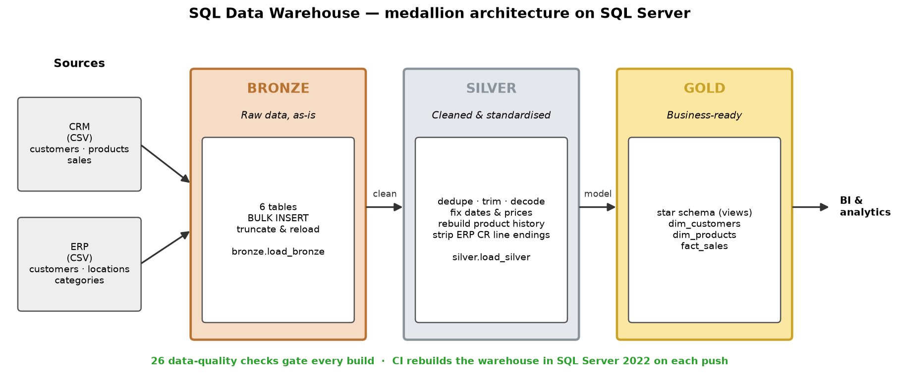

# SQL Data Warehouse

[](https://github.com/MRafiqAsim/SQL_Data_Warehouse/actions/workflows/ci.yml)

A sales data warehouse on **Microsoft SQL Server**, built with the **medallion architecture**: raw CSV exports from a CRM and an ERP system are loaded into a Bronze layer, cleaned and standardised in a Silver layer, and modelled into a star schema in a Gold layer for reporting.

## Architecture



| Layer | Purpose | Load |
|---|---|---|
| **Bronze** | Raw copies of the source files, unchanged, for traceability | Truncate and `BULK INSERT` from CSV (`bronze.load_bronze`) |
| **Silver** | Cleaned, standardised and de-duplicated tables with consistent types | Truncate and reload (`silver.load_silver`) |
| **Gold** | Business-ready star schema: `dim_customers`, `dim_products`, `fact_sales` | Views over Silver |

The Gold model is documented column by column in the [data catalog](docs/data_catalog.md).

### Source data

Two source systems, six tables:

| System | Table | Content |
|---|---|---|
| CRM | `crm_cust_info` | Customers |
| CRM | `crm_prd_info` | Products and their history |
| CRM | `crm_sales_details` | Sales orders |
| ERP | `erp_cust_az12` | Customer birth date and gender |
| ERP | `erp_loc_a101` | Customer country |
| ERP | `erp_px_cat_g1v2` | Product categories and maintenance flag |

Tables are named `<source>_<entity>` in Bronze and Silver, so lineage stays obvious.

### Data quality issues fixed in Silver

Profiling the raw data turned up these issues, which `silver.load_silver` resolves:

| Source | Issue | Fix |
|---|---|---|
| CRM customers | Missing and duplicate customer IDs; names with stray spaces; coded gender and marital status | Drop missing IDs, keep the latest record per customer, trim names, expand codes |
| CRM products | End dates *before* start dates on 200 of 397 rows; missing costs; category and product key packed into one field | Rebuild validity periods from the next version's start date, default cost to 0, split the key |
| CRM sales | Dates stored as `YYYYMMDD` integers, some invalid (`0`, `5489`); sales ≠ quantity × price; missing or negative prices | Convert valid dates only, recompute sales and derive prices |
| ERP customers | `NAS` prefix on IDs; birth dates in the future; nine spellings of gender | Strip the prefix, null future dates, normalise gender |
| ERP locations | Dashes in IDs; `DE` / `US` / `USA` mixed with full names; blanks | Remove dashes, expand country codes, `n/a` for blanks |
| ERP files | Windows line endings leave a hidden `\r` on the last column | Strip `CHAR(13)` before comparing values |

## Run it

You need SQL Server 2019+ — locally, or in Docker:

```bash
docker run -d --name sqlserver -p 1433:1433 \
  -e ACCEPT_EULA=Y -e MSSQL_SA_PASSWORD='<YourStrong!Passw0rd>' \
  mcr.microsoft.com/mssql/server:2022-latest
```

Download the six source CSVs (from the course's public dataset, MIT-licensed) and copy them into the container root, where the Bronze load expects them:

```bash
BASE=https://raw.githubusercontent.com/DataWithBaraa/sql-data-warehouse-project/main/datasets
for f in source_crm/cust_info source_crm/prd_info source_crm/sales_details \
         source_erp/CUST_AZ12 source_erp/LOC_A101 source_erp/PX_CAT_G1V2; do
  curl -sSfo "$(basename $f).csv" "$BASE/$f.csv"
  docker cp "$(basename $f).csv" sqlserver:/
done
```

**Fastest:** build everything and run all checks with one script:

```bash
CONTAINER=sqlserver MSSQL_SA_PASSWORD='<YourStrong!Passw0rd>' ./ci/build_and_test.sh
```

It downloads the data itself, so the manual download above is only needed for the step-by-step route. **Step by step**, run the scripts in order in the `DataWarehouse` database (SQL Server Management Studio, Azure Data Studio or `sqlcmd -d DataWarehouse`):

| Step | Script | What it does |
|---|---|---|
| 1 | [`scripts/init_database.sql`](scripts/init_database.sql) | Creates the `DataWarehouse` database with `bronze`, `silver` and `gold` schemas (drops it first if it exists) |
| 2 | [`scripts/bronze/ddl_bronze.sql`](scripts/bronze/ddl_bronze.sql) | Creates the Bronze tables |
| 3 | [`scripts/bronze/proc_load_bronze.sql`](scripts/bronze/proc_load_bronze.sql) | Creates `bronze.load_bronze`; run it with `EXEC bronze.load_bronze;` |
| 4 | [`scripts/silver/ddl_silver.sql`](scripts/silver/ddl_silver.sql) | Creates the Silver tables (with a `dwh_create_date` audit column) |
| 5 | [`scripts/silver/proc_load_silver.sql`](scripts/silver/proc_load_silver.sql) | Creates `silver.load_silver`; run it with `EXEC silver.load_silver;` |
| 6 | [`scripts/gold/ddl_gold.sql`](scripts/gold/ddl_gold.sql) | Creates the Gold star-schema views |
| 7 | [`tests/quality_checks_silver.sql`](tests/quality_checks_silver.sql), [`tests/quality_checks_gold.sql`](tests/quality_checks_gold.sql) | Data-quality checks; each prints PASS / FAIL per rule and raises an error on any failure |

Both load procedures truncate and reload every table, log row counts and durations, and report errors through `TRY…CATCH`.

Once loaded, the Gold layer is ready for analysis, for example revenue by country:

```sql
SELECT c.country, SUM(f.sales_amount) AS revenue
FROM gold.fact_sales AS f
JOIN gold.dim_customers AS c ON c.customer_key = f.customer_key
GROUP BY c.country
ORDER BY revenue DESC;
```

> ⚠️ `init_database.sql` drops and recreates the `DataWarehouse` database. Run it only where losing that database is fine.

## Project structure

```
scripts/
├── init_database.sql      # database and schemas
├── bronze/                # raw tables and the CSV load procedure
├── silver/                # cleaned tables and the cleaning procedure
└── gold/                  # star-schema views
tests/                     # data-quality checks for Silver and Gold
docs/data_catalog.md       # Gold layer columns and meaning
ci/build_and_test.sh       # builds the warehouse and runs all checks (used by CI)
```

## CI

Every push starts SQL Server 2022 in a GitHub Actions service container, builds Bronze → Silver → Gold from the source CSVs and runs all data-quality checks; the build fails if any check fails.

## Acknowledgements

Built while learning from [Data With Baraa](https://www.youtube.com/@datawithbaraa)'s SQL Data Warehouse course, whose public materials provided the dataset and the starting point for the database setup and table definitions. The Silver cleaning logic, the Gold model, the data-quality checks and the CI pipeline in this repository are my own.

## License

[MIT](LICENSE)
